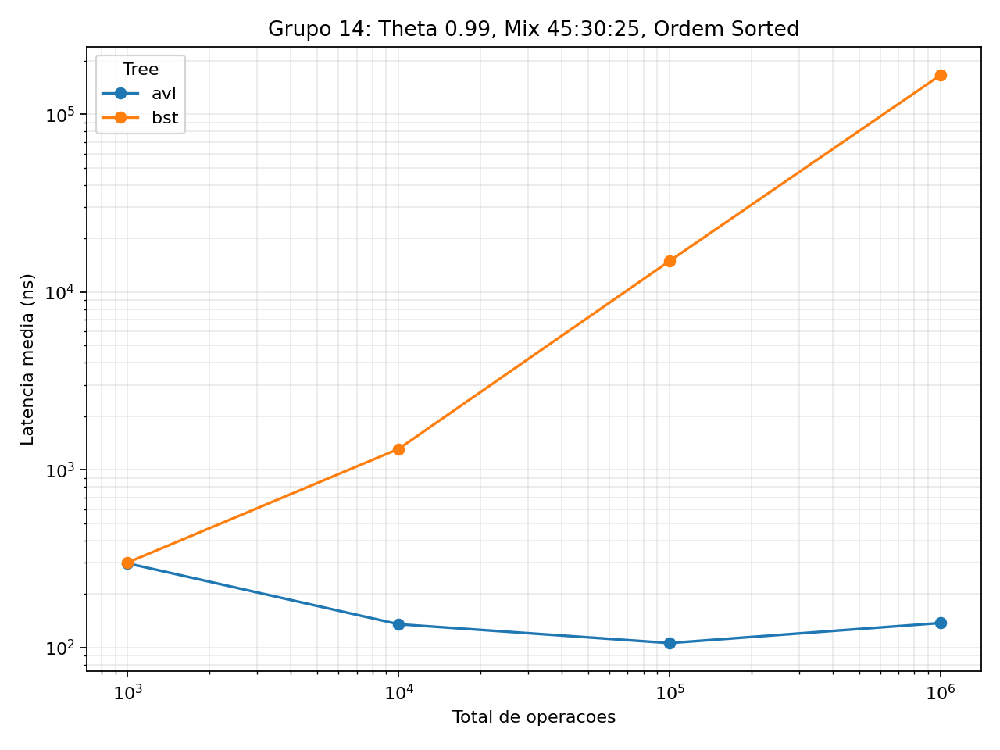

# AVL Aumentada - Grupo 14

Implementacao e avaliacao empirica de uma arvore AVL aumentada para a disciplina
AL0334 - Estrutura de Dados. A estrutura armazena chaves inteiras de 64 bits,
mantem metadados de altura e tamanho de subarvore e oferece operacoes ordenadas
em tempo logaritmico.

## Resultado principal

Na configuracao oficial do Grupo 14 (`face`, theta `0.99`, mix `45:30:25`,
ordem `sorted`, seed `14`), a AVL manteve latencia media de **137,7 ns** em um
milhao de operacoes. A BST nao balanceada atingiu **166.278,6 ns**: a AVL foi
aproximadamente **1.207,5 vezes mais rapida** no caso patologico.



As 64 medicoes reais e os seis graficos utilizados na analise estao em
[results/final](results/final/).

## Operacoes

| Operacao | Descricao | Complexidade AVL |
| --- | --- | --- |
| `insert(k)` | insere sem duplicar | `O(log n)` |
| `delete(k)` | remove, se existir | `O(log n)` |
| `search(k)` | consulta pertinencia | `O(log n)` |
| `rank(k)` | conta chaves menores que `k` | `O(log n)` |
| `select(i)` | retorna a chave de indice ordenado `i` | `O(log n)` |
| `rangeMin(a, b)` | menor chave no intervalo inclusivo | `O(log n)` |

## Arquitetura

```text
gen_workload_1.py
        |
        v
TraceRunner --> OrderedLongSet --> AugmentedAvlTree
                            \--> UnbalancedBst
        |
        v
oraculo de corretude --> BenchmarkRunner --> results.csv --> graficos
```

- `OrderedLongSet`: contrato comum entre AVL e BST.
- `AugmentedAvlTree`: AVL aumentada com altura e tamanho de subarvore.
- `UnbalancedBst`: baseline deliberadamente ingenua.
- `TraceRunner`: executa traces e produz respostas para o oraculo.
- `BenchmarkRunner`: mede media, P50 e P99 sem incluir leitura de arquivo.

Detalhes: [arquitetura](docs/ARQUITETURA.md) e
[relatorio tecnico](docs/RELATORIO.md).

## Reproducao

Requisitos: JDK 17 ou superior e Python 3 com as dependencias de
`requirements-dev.txt`.

Clone o repositorio e entre na pasta do projeto:

```powershell
git clone https://github.com/bNDorneles/Estrutura-de-dados.git
cd Estrutura-de-dados
```

No Windows:

```powershell
python -m pip install -r requirements-dev.txt
.\mvnw.cmd clean test package
python -m unittest discover scripts
```

No Linux ou macOS:

```bash
python3 -m pip install -r requirements-dev.txt
./mvnw clean test package
python3 -m unittest discover scripts
```

### Experimento oficial

O dataset SOSD `face` nao e versionado. Depois de coloca-lo em
`datasets/face`, gere e execute a matriz:

```powershell
python scripts/experiment_matrix.py `
  --keys datasets/face `
  --format sosd `
  --key-bytes 8 `
  --max-load 10000000 `
  --ops 1000,10000,100000,1000000 `
  --thetas 0.0,0.6,0.99,1.2 `
  --orders shuffle,sorted `
  --mix 45:30:25 `
  --seed 14 `
  --outdir scratch/matrix-face

.\scratch\matrix-face\commands.ps1
python scripts/plot_results.py `
  --input scratch/matrix-face/results.csv `
  --outdir scratch/matrix-face/plots
```

Cada trace e validado pelo oraculo para AVL e BST antes da coleta. A medicao
usa 3 ciclos de aquecimento e 10 repeticoes, executados nativamente no Windows
11 com JVM 21.0.9.

## Entrega

- [Resultados finais](results/final/)
- [Relatorio tecnico](docs/RELATORIO.md)
- [Arquitetura e invariantes](docs/ARQUITETURA.md)
- [Metodologia experimental](docs/EXPERIMENTOS.md)
- [Preparacao para defesa](docs/DEFESA.md)
- [Indice de prompts](docs/PROMPTS.md)
- [Dump organizado do chat](docs/CHAT_DUMP.md)
- [Checklist final](docs/ENTREGA_FINAL.md)

O video e os slides da apresentacao oral sao entregues separadamente pelo
grupo e, por isso, nao sao versionados neste repositorio.

## Autoria

- `bNDorneles`: nucleo AVL, invariantes, integracao e justificativa tecnica.
- `gustavodanjos`: trace, baseline BST, benchmark, CSV e graficos.
- Ambos: experimentos, interpretacao, relatorio e defesa.
